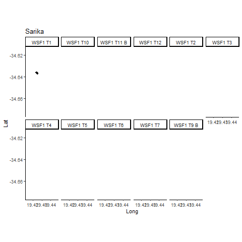

class: top, center, middle
```{r setup, include=FALSE}
options(htmltools.dir.version = FALSE)
```

```{r xaringan-themer, include=FALSE}
library(xaringanthemer)
solarized_light(
  code_font_family = "Fira Code",
  code_font_url    = "https://cdn.rawgit.com/tonsky/FiraCode/1.204/distr/fira_code.css"
)
```

# What is data science? 

 Maybe a combination of Statistics, Computer Science and Mathematics? 


--

 What about machine learning and big data?

--

 In this talk we'll ignore any pre-conceived notions of what data science is and focus on:  

--

## ** << how to tell stories with data >> **


---
class: top
# Outline: 


.center[
**What is the question of interest?**
]

--

.center[
**What type of data do we need to collect?** 
]

--

.center[
**What methodology should we use?** 
]

--

.center[
**Interpreting our results**
]

--

.center[
**The grand finale.**
]


---
class: inverse, center, middle

# Story Time


---
class: top, middle

# What Story Do We Want Tell? 

This is usually the easier part -- there are so many cool questions we can try to answer with data! 

_Some examples_: 

- ** How do white sharks react to tourism boats? **

.center[

]

- ** How can we personalize (clothing/videos/products)? ** Check out StitchFix's algorithms team. 

.center[

]


---
class: top, left

# How do we tell our story with data? 

One of the hardest parts and one of the most important steps. **Domain expertise comes in!** [*]

1. Quantifying the behavior we want to observe. Evaluating and re-evaluating. 

2. Is it feasible to collect that information? 

3. What information can we not collect? 

4. Re-examining our original question and re-formulating it with what's possible. 


_______________________________________________

--

_Data are objective_ $\rightarrow$ **FALSE** 

We make decisions about what data to use to answer questions, decisions about how to collect the data, etc. Let's fully embrace subjectivity in every step of the process. 


--

.footnote[[*]Domain expertise is a must. Not using it can lead to extremely irresponsible practices.]


---

class: top

# Quantifying the behavior we want to observe.

.center[
$\rightarrow$ `This sets in motion the type of analysis that will be used.` 
]

For instance, let's look at this question: 

.center[
** How do white sharks react to tourism boats? **
]

- What do we mean by _react_?

- We need to quantify their movements. 

- Data (location) is collected approximately every 5-minutes. 

When we talk about 'white shark' behaviors for this project, we mean "movement patterns observed at a 5-minute temporal scale"

--

Even the phrase "movement patterns" can be and is quite subjective. 

---
class: top, inverse

# White Shark Movements

.center[

]

Data collected by Alison Towner.

---
class: top, inverse

# Bull Shark Movements

Work with [Pelagios Kakunjá](http://pelagioskakunja.org/). 

```{r, echo=FALSE, message=FALSE, fig.height=5, fig.width=12}
library(tidyverse)
library(ggplot2)
library(cowplot)
library(magrittr)

cbPalette <- c("#999999", "#E69F00", "#56B4E9", "#009E73", "#F0E442", "#0072B2", "#D55E00", "#CC79A7")


tibs <- read_csv("Base_Final_Cabo_Pulmo.csv")
tibs$ID <- as.numeric(as.factor(tibs$Individuos_Detectados))
tibs%<>%mutate(res = as.numeric(`#_Detecciones` > 0 ))

ggplot(tibs%>%group_by(ID)%>%summarize( n = sum(res)), aes(ID, n)) + 
  geom_point(size=3, alpha=.8, color=cbPalette[3]) + 
  xlab("Shark ID") + ylab("Number of Days Detected") + 
  ggtitle("Bull Shark Detections in Cabo Pulmo, MX") + 
  theme_minimal()

```


For more shark work: check out [MigraMar](http://migramar.org/hi/en/) and [Alex Hearn](http://migramar.org/hi/en/assembly-members/hearn/). 

---
class: top, left

# Data Organization and Manipulation

**Organization**

Organizing and structuring your data set is one of the most important aspects in any project. 

.center[

]


**Manipulation**

Writing scripts to go from the _raw_ data set to the formatted data set for analysis. In `R`, take a look at the [tidyverse](https://www.tidyverse.org/). 


---
class: top, center

# What Next? 

Once we've quantified the question we'd like to answer and collected data, exploratory data analysis can be done. 

.center[
**Lots and lots of plots.** 
]


Depending on what our story is so far, we'll attempt to match our data story with an appropriate model. 


.footnote[Keep in mind, what plots we make and what models we choose is also be subjective. We'll embrace it.]

---
background-position: 100%
class: top, center, inverse

# What models are seen as...


---
background-position: 100%
class: top, center inverse

# How we should think of models...


---

#Our old friend: Simple Linear Regression 

Basic setup: 

$$ y = \beta_0 + \beta_1x + \epsilon $$ 

$$ \epsilon \sim N(0, \sigma^2) $$


--


Altogether, we have

$$ f(y|x) \sim N(\beta_0 + \beta_1x, \sigma^2) $$

--

Intrepretation of the parameters $\beta_0, \beta_1, \sigma^2$: 

- $\beta_0$ = the expected value of y when x=0

- $\beta_1$ = the expected change in y when you increase the value of x by 1

- $\sigma^2$ = a measure of the variability around the mean ( $\beta_0 + \beta_1x$ )

---

background-position: 100%
class: top

# The story of SLR

**What does it actually mean?**

.center[
<image src = "normals.png" width="500" height="400" />
]

The means under different values of $x$ are connected (they're friends on a line.)


---

# SLR is an abstract concept

Like all statistical models. One of the best ways to learn about a model is to simulate from it. 

.pull-left[

### Deterministic (fixed, unknowns): 

- $\beta_0, \beta_1$

- $\sigma^2$

]

.pull-right[

### Stochastic (drawn from a distribution): 

- $\epsilon \sim N(0, \sigma^2)$

]

```{r}
#R Code
set.seed(17)

beta0 <- 1
beta1 <- 2
std.dev <- 5

x <- rt(n = 150, df = 3)
y <- beta0 + beta1*x + rnorm(n=150, mean = 0, sd=std.dev)
```

---
class: middle
**Simulating Data from a SLR**


```{r, eval=F}
#R Code
set.seed(17)

beta0 <- 1
beta1 <- 2
std.dev <- 5

x <- rt(n = 150, df = 3)
{{ y <- beta0 + beta1*x + rnorm(n=150, mean = 0, sd=std.dev) }}
```

```{r, echo=FALSE, message=FALSE, fig.height=4, fig.width=12}


xy <- data.frame(x=x, y=y, mean = beta0 + beta1*x)

g1 <- ggplot(xy, aes(y)) + 
  geom_histogram(fill=cbPalette[8], color="black", bins=30) + 
  theme_minimal() + 
  xlab("Y") + ylab("Count") + 
  ggtitle("Histogram of Values of Y")


g2 <- ggplot(xy, aes(x, y)) + geom_point(color=cbPalette[8], size=2) + 
  theme_minimal() + 
  geom_abline(aes(slope=beta1, intercept=beta0), size=1) + 
  xlab("X") + ylab("Y") +
  ggtitle("Scatter plot of X and Y for sample size of 150")

plot_grid(g1, g2)

```

---

Simulating data from a SLR when the sample size $N = 50, 200, 500$

```{r, echo=FALSE, fig.height=3, fig.width=12}

len <- c(50, 200, 500)

for(j in 1:3){

x <- rt(n = len[j], df = 3)
y <- beta0 + beta1*x + rnorm(n=len[j], mean = 0, sd=std.dev)  
  
xy <- data.frame(x=x, y=y, mean = beta0 + beta1*x)

g11 <- ggplot(xy, aes(y)) + 
  geom_histogram(fill=cbPalette[8], color="black", bins=30) + 
  theme_minimal() + 
  xlab("Y") + ylab("Count") + 
  ggtitle(paste("Histogram of Y for sample size of ", len[j], sep=""))


g21 <- ggplot(xy, aes(x, y)) + geom_point(color=cbPalette[8], size=2, alpha=.5) + 
  theme_minimal() + 
  geom_abline(aes(slope=beta1, intercept=beta0), size=1) + 
  xlab("X") + ylab("Y") +
  ggtitle(paste("Scatter plot of X and Y for sample size of ", len[j], sep=""))

print(plot_grid(g11, g21))

}

```


---
Simulating data from a SLR when the sample size of $N = 200$ and parameter values of $\beta_0 = 1, \beta_1 = -2, \sigma=5$


```{r, echo=FALSE, fig.height=3, fig.width=12}

beta0 = 1
beta1=-2
std.dev = 5
len <- rep(200, 3)

for(j in 1:3){

x <- rt(n = len[j], df = 3)
y <- beta0 + beta1*x + rnorm(n=len[j], mean = 0, sd=std.dev)  
  
xy <- data.frame(x=x, y=y, mean = beta0 + beta1*x)

g11 <- ggplot(xy, aes(y)) + 
  geom_histogram(fill=cbPalette[8], color="black", bins=30) + 
  theme_minimal() + 
  xlab("Y") + ylab("Count") + 
  ggtitle(paste("Histogram of Y for sample size of ", len[j], sep=""))


g21 <- ggplot(xy, aes(x, y)) + geom_point(color=cbPalette[8], size=2, alpha=.5) + 
  theme_minimal() + 
  geom_abline(aes(slope=beta1, intercept=beta0), size=1) + 
  xlab("X") + ylab("Y") +
  ggtitle(paste("Scatter plot of X and Y for sample size of ", len[j], sep=""))

print(plot_grid(g11, g21))

}
```


---

# Generalized Linear Model: Poisson Log-Linear Model

Here, we imply that $f(y|x) \sim Poisson(\lambda_x)$. 


$$ y|x \sim Poisson (\lambda) $$ 

$$ log(\lambda) = \beta_0 + \beta_1 x $$


A special property of the Poisson distribution is that $E(y|x) = Var(y|x) = \lambda_x$. 

**Poisson distribution with $\lambda = 5$:** 

```{r echo=FALSE, fig.height=3, fig.width=12}

xs <- 0:20
obs <- dpois(xs, lambda=5)

ggplot(data=data.frame(xs, obs, y=0), aes(xs, obs)) + 
  geom_point(aes(xs, obs), color=cbPalette[1], size=3) +
  geom_segment(aes(x=xs, y=y, xend=xs, yend=obs), 
               color=cbPalette[3], size=1) + 
  xlab("Value") + ylab("Mass Function") + 
  theme_minimal()

```


---

# The story of the Poisson Log-Linear Model


For every value of $x$, we expect to see observations $y$ that are generated according to the Poisson distribution with $\lambda_x = e^{\beta_0 + \beta_1 x}$. 

```{r , message=FALSE, warning=FALSE, echo=FALSE, fig.height=5, fig.width=12}

xs1 <- 0:50
obs1 <- dpois(xs1, lambda=5)
obs2 <- dpois(xs1, lambda=20)

p1 <- ggplot(data=data.frame(xs1, obs1, y=0), aes(xs1, obs1)) + 
  geom_point(aes(xs1, obs1), color=cbPalette[1], size=3) +
  geom_segment(aes(x=xs1, y=y, xend=xs1, yend=obs1), 
               color=cbPalette[7], size=1) + 
  xlab("Value") + ylab("Mass Function") + 
  ggtitle("Mean and variance = 5") + 
  theme_minimal()

p2 <- ggplot(data=data.frame(xs1, obs2, y=0), aes(xs1, obs2)) + 
  geom_point(aes(xs1, obs2), color=cbPalette[1], size=3) +
  geom_segment(aes(x=xs1, y=y, xend=xs1, yend=obs2), 
               color=cbPalette[7], size=1) + 
  xlab("Value") + ylab("Mass Function") + 
  ggtitle("Mean and variance = 20") + 
  theme_minimal()


plot_grid(p1, p2)

```


---

# Simulating from a Poisson Log-Linear Model

```{r}

pbeta0 <- 0.1
pbeta1 <- 0.2

px <- runif(n=100, min=-5, max=5)
xlambda <- exp(pbeta0 + pbeta1*px)
py <- rpois(n=100, lambda=xlambda)

```

```{r, fig.height=3, fig.width=12, echo=FALSE}

ggplot(data=data.frame(px, py), aes(px, py)) +
  geom_point(color = cbPalette[8], size=2, alpha=0.8) + 
  theme_minimal() + 
  xlab("X") + 
  ylab("Y")

```

---

# Hierarchical Model

**One example**

$$y_{ij} \sim Poisson(\lambda_{ij})$$

$$log(\lambda_{ij}) = \beta_{0,i} + \beta_{1,i} x_{ij}$$

$$\beta_{0,i} \overset{iid}{\sim} N(\mu_0, \sigma_0^2)$$

$$\beta_{1,i} \overset{iid}{\sim} N(\mu_1, \sigma_1^2)$$

### Story

Similar to the Poisson Log-Linear Model from before, but now we assume that some parameters vary across groups. However(!), the parameters $\beta_{0,i}$ and $\beta_{1,i}$ are linked across groups!


---

# Simulating from a Hierarchical Model


```{r}
## 10 individuals
pb0h <- rnorm(n = 10, mean = 0.1, sd = 0.1)
pb1h <- rnorm(n=10, mean=0.2, sd=0.1)

pxh <- matrix(data=NA, nrow=10, ncol=20) 
pyh <- matrix(data=NA, nrow=10, ncol=20)
for(j in 1:10){
  pxh[j,] <- runif(n=20, min=-5, max=5)
  pyh[j,] <- rpois(n=20, lambda=exp(pb0h[j] + pb1h[j]*pxh[j,]))
}

```

```{r, fig.height=4, fig.width=12, echo=FALSE}

ggplot(data=data.frame(pxh = c(pxh), pyh= c(pyh), group = paste("Group: ", rep(1:10, each=20), sep="")), aes(pxh, pyh)) +
  geom_point(aes(color=as.factor(group)), size=2, alpha=0.8) + 
  theme_minimal() + facet_wrap(~group) + 
  xlab("X") + theme(legend.position = "none") + 
  ylab("Y")

```


---

# Simulation -- The Underused Tool


Advantages of simulation:

- No data needed. 

- We can learn about what are models actually do, e.g. how different parameter values affect the outcome. 

- We build intuition about what different models imply. 

--

If after simulation it's hard to understand what these parameters mean in the overall context...

--

.center[
**we can always go back and do more simulations!**
]

--


*It'll be hard to interpret the parameters if we don't have a good idea of what they actually mean for our process.*


---
class: inverse, top
# Choosing candidate models


.center[
## **Remember: every model tells a story.** 
]

--

.center[
## **How does the models' story tie into the story we want to tell? ** 
]

--

.center[
## **When we simulate data from various models, does it look like the data we have?** 
]


---
class: center, inverse

# Fitting models to data

It's one thing to think about the wonderful stories that models to tell. And another thing to face the reality of trying to fit these models to data. 

--

**Some models are well-behaved with small data sets...**


--

**Some models are data hungry...**


---
class: top

# Back to Simulation

Even if your story matches perfectly with a model's story...a fairytale ending isn't certain. 

--

.center[
Models need a certain amount of information before they reveal secrets about the data...
]

.center[
_(in proper statistical terms: `estimability/identifiability`)_
]

--

______________________________


**Good practice:** 

- Put together information about your data: 

.center[
*What's the sample size?* *How many replicates are there?* *Number of individuals?*
]

--

- Simulate data from the model that matches your data specifics

--

- Fit the model to the simulated data. What do you see? How much uncertainty is there in the parameter estimates? 


---
class: top

#Fitting a Model


Once we fit a model to our data, but not before constructing uncertainty intervals, we begin to examine the patterns that are revealed. 

--

- Can we interpret the parameters? 

--

- Are the results inline with what was expected? 

--

- _I'm sidestepping the idea of 'significance' on purpose._ In favor of...

--

- How do the values of my parameters jointly tell the story? 

--


.footnote[
For Bayesian inference, check out [Stan](https://mc-stan.org/). 
]

---

#Assessing/Interpreting a Model

Mostly done in the context of 'posterior predictive checks' when conducting Bayesian inference, this idea falls into the class of simulation-based model assessment. 


`Simulate data from the fitted model`: $\mathbf{y}_{rep}^*$ 

- Draw values of the parameters $\boldsymbol{\theta}^*$ from their distributions 

- Plug in $\boldsymbol{\theta}^*$ into the model to simulate values of $\mathbf{y}_{rep}^*$ 

- Repeat above steps multiple times (say, 100 times)

- Compare $\mathbf{y}_{rep}^*$  to $\mathbf{y}$

**The key idea is: if our model is the _data generating mechanism_, could it generate data like ours?**

Of course, there are still residuals and other traditional measures of model evaluation. 


---
#Interpeting our Model Results

We need to make sure we interpret the results in the context of: 

--

- How we quantified the story we want to tell. 

--

- What information was collected. 

--

- `What information was NOT collected`

--

- What kinds of data can our model produce? And what does that imply about the real world? 

---
class: top

#Historias con Impacto

--

.center[
**The biggest impact we can have is when we make `discoveries` about the world we live in.** 
]


---
# Historias con Impacto

Something to always keep in mind: `the stories we tell come from our perspectives, shaped by our experiences and driven by our personal choices.` Being open and transparent about this is part of telling an impactful story.  


--

.pull-left[

`Reproducible research:` 

- Can anyone reproduce your workflow? 

- Do the results reproduce? 

- [RMarkdown](https://rmarkdown.rstudio.com/)


`Data availability:` 

- Making the data available


]

--

.pull-right[

`Research that's accessible to everyone:` 

- Why did the story turn out the way it did? 

- What was tried? 

- What failed? 

- Allowing insights into your research process. 

]

---

class: center, middle

# ¡Gracias!

 


Slides created via the R package [**xaringan**](https://github.com/yihui/xaringan).


